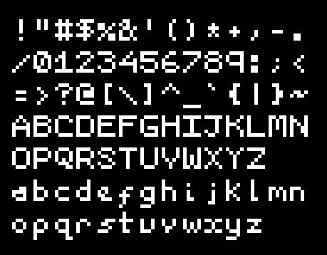

# Bitcast
 _Small, fast, and simple bitmap fonts in single-file C headers_

These are not intended as a replacement for fancy user fonts.
I see them being useful for quickly getting up debug text on a PC, or for embedded developers with limited memory.

## Contents
- [bitcast16](#bitcast16)
- [bitcast32](#bitcast32)
- [API](#api)
	- [Functions](#functions)
	- [Constants](#constants)
	- [Types](#types)
- [How it works](#how-it-works)
- [Recommended libraries](#recommended-libraries)

## bitcast16


## bitcast32


## API
_Replace the prefix number if using a different font._

### Functions
``` c
bitcast16_String();
bitcast16_Char();
IndexFromASCII(unsigned int index);
ASCIIFromIndex(unsigned int index);
```

### Constants
``` c
BITCAST16_WIDTH
BITCAST16_WIDTH
BITCAST16_BASELINE_OFFSET
BITCAST16_ADVANCE
```

### Types
|| introduces alias to unsigned integer with enough bytes

## How it works 
|| array of strings starting, each representing the bitmap for a single character, and laid out in ANSI order.
|| break the string into a grid, use `'#'` for drawn pixels and `' '` for gaps.
|| generate a binary from this and store in an appropriately sized uint.
|| remaining bits are used for e.g. shifting the whole grid down, to allow for descenders.

1) draw glyph in text editor (easier with a square font)
```
```
2) linearize
```
```
3) turn to bits
```
```
4) also represented as a number (in hexadecimal)
```
```
5) collect a lot of these into an array, sorted in the ASCII code order
```
```
6) TADAA! We have a font.

## Recommended Libraries
- [sweet](https://github.com/azmr/sweet) (my single-header test suite)
- [live_edit](https://github.com/azmr/live_edit) (my single-header C library-loading/tweaking/debugging/profiling tools)
- [STB libraries](https://github.com/nothings/stb) (lots of excellent single-header libraries, including `stb_truetype.h` for when you want proper fonts)
